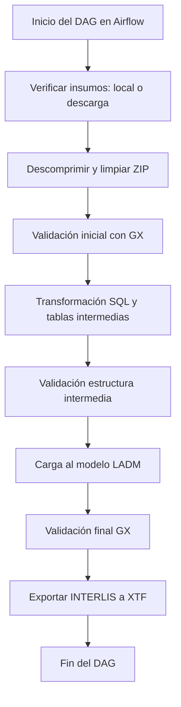

# 🛠 Submódulo ETL - Áreas Protegidas (AP)

Este submódulo forma parte del sistema de automatización **Orquestador_OTLS**, el cual tiene como objetivo principal orquestar flujos ETL (Extract, Transform, Load) para distintas líneas temáticas relacionadas con modelos geográficos extendidos definidos por el Ministerio de Ambiente y Desarrollo Sostenible (MADS) de Colombia. En particular, este submódulo está orientado a procesar, transformar y validar datos de **Áreas Protegidas (AP)**, alineándolos al modelo extendido **LADM_COL_v_1_0_0_Ext_AP**.

Utiliza Apache Airflow como motor de ejecución, PostgreSQL con PostGIS como sistema gestor de base de datos, INTERLIS como estándar de intercambio de datos, y Great Expectations para la validación estructural de datos.

---

## Estructura del Submódulo

La siguiente estructura representa todos los archivos y carpetas del submódulo, organizados por su función dentro del flujo de trabajo:

```plaintext
submodule_ap/
├── dag_ap/                         # DAG de Airflow que orquesta el proceso ETL para la línea temática AP
│   ├── etl_ap_sql.py              # Lógica SQL que transforma los insumos en estructuras intermedias
│   ├── etl_ap_xtf.py              # Exporta los datos transformados al formato XTF (DAG)
│
├── etl_ap/                         # Lógica de transformación, validación y configuración de la ETL
│   ├── gx/                         # Reglas de validación con Great Expectations
│   │   ├── gx_estructura_intermedia.yml   # Valida la estructura de las tablas intermedias resultantes del ETL
│   │   ├── gx_insumos.yml                # Valida la integridad, formatos y campos obligatorios de los insumos
│   │   └── gx_ladm.yml                   # Valida que los datos migrados cumplan con el modelo LADM
│   │
│   ├── insumos/                    # Insumos originales (formato bruto) descargados o cargados manualmente
│   │   ├── area_protegida/              # Archivos geográficos (SHP, GPKG) de parques y reservas protegidas
│   │   └── informacion_runap/           # Reportes DANE  XLSX del sistema RUNAP como resoluciones de declaratorias o registros
│   │
│   ├── temp/                       # Carpeta de trabajo temporal para transformación previa
│   │   ├── area_protegida/              # Datos intermedios convertidos desde los insumos originales
│   │   ├── informacion_runap/           # Versiones limpias, normalizadas o fusionadas de los archivos Excel
│   │   ├── area_protegida.zip           # Descarga temporal comprimida desde el enlace público de RUNAP
│   │   └── informacion_runap.zip        # Descarga del archivo Excel comprimido desde el enlace público
│   │
│   ├── config_ap.json              # Archivo de configuración funcional del ETL:
│   │                               # - Datos de conexión a la base PostgreSQL
│   │                               # - Modelo INTERLIS (nombre y XTF)
│   │                               # - Rutas de descarga y rutas locales alternativas de insumos
│   │                               # - Nombre de la línea temática y su módulo SQL
│   │
│   └── config.json                 # Archivo de configuración de rutas absolutas internas:
│                                   # - Carpeta del modelo .ili
│                                   # - Carpeta ETL del submódulo
│                                   # - Carpeta temporal de trabajo
│                                   # - Carpeta de validaciones GX
│
├── modelo_ap/                      # Archivos INTERLIS y documentación relacionada al modelo extendido
│   ├── diagrama                    # Imagen conceptual del modelo extendido (AP)
│   ├── ISO19107_PLANAS_V3_1_3.ili       # Modelo geométrico base requerido por INTERLIS
│   ├── LADM_COL_v_1_0_0_Ext_AP.ili      # Modelo INTERLIS extendido para Áreas Protegidas
│   ├── LADM_COL_v_1_0_0_Ext_AP.uml      # Representación UML del modelo AP
│   └── LADM_COL_v_4_0_1_Nucleo_3.ili    # Núcleo obligatorio del modelo LADM_COL
│
└── README.md                      # Este archivo, con documentación y descripción técnica del submódulo


# 🛠 Submódulo ETL - Áreas Protegidas (AP)

Este submódulo hace parte del Orquestador_OTLS y automatiza la transformación, validación y carga de datos relacionados con Áreas Protegidas (AP) al modelo extendido **LADM_COL**. Está diseñado para ser ejecutado de forma programada o manual mediante **Apache Airflow**, utilizando archivos INTERLIS, insumos geográficos y alfanuméricos, y validaciones con **Great Expectations**.

Su diseño modular permite escalar a otros modelos temáticos simplemente adaptando los archivos de configuración.

---

## 📁 Descripción General del Submódulo

```plaintext
submodule_ap/
├── dag_ap/                         
├── etl_ap/                         
├── modelo_ap/                      
└── README.md
```

---

### 📂 `dag_ap/` - DAG de Airflow

Contiene el archivo `dag_ap.py` que define el **flujo de trabajo DAG** para ejecutar la ETL. Este DAG utiliza los módulos, configuraciones y funciones definidas en `etl_ap/`.

- Define tareas como: descarga de insumos, descompresión, validación con GX, transformación, carga a PostgreSQL y exportación a XTF.
- Utiliza rutas y parámetros definidos en los archivos `config.json` y `config_ap.json`.

---

### 📂 `etl_ap/` - Lógica del proceso ETL

Esta carpeta agrupa toda la lógica, archivos de configuración e insumos necesarios para procesar los datos de AP.

#### 📁 `gx/` - Validaciones con Great Expectations

Archivos `.yml` de validaciones GX ejecutadas durante la ETL:

- `gx_estructura_intermedia.yml`: valida tablas intermedias creadas antes del modelo final.
- `gx_insumos.yml`: verifica calidad, presencia de campos y estructura en insumos crudos.
- `gx_ladm.yml`: asegura que la carga final cumpla el modelo LADM_COL definido.

Estas validaciones son críticas para garantizar la integridad de los datos antes de su migración.

---

#### 📁 `insumos/` - Insumos originales

Carpeta donde se almacenan los archivos originales sin procesar. Pueden provenir de una descarga web (ver `config_ap.json`) o ser cargados manualmente.

- `area_protegida/`: insumo geográfico ZIP con shapefiles de las áreas protegidas --Viene de la página de Parques Nacionales Naturales de Colombia-- Sistema RUNAP.
- `informacion_runap/`: Reportes DANE  XLSX del sistema RUNAP como resoluciones de declaratorias o registros.

---

#### 📁 `temp/` - Carpeta temporal de trabajo

Espacio de trabajo donde se descomprimen y procesan los insumos. Contiene tanto archivos descomprimidos como intermedios.

- Subcarpetas para cada insumo (`area_protegida/`, `informacion_runap/`)
- Archivos `.zip` originales descargados desde el endpoint.
- Archivos temporales generados durante la transformación o validación.

---

#### 📄 `config_ap.json` - Configuración funcional del submódulo

Contiene los parámetros **específicos de la línea AP**, como:

- Conexión a base de datos (`host`, `user`, `db_name`)
- Nombre del archivo `.xtf` y modelo `.ili` para exportación
- URLs de insumos web y rutas locales alternativas
- Módulo donde se encuentra la lógica SQL de transformación (`etl_sql_module_dir`)

Este archivo es leído dinámicamente durante la ejecución del DAG para personalizar el proceso.

---

#### 📄 `config.json` - Rutas internas del submódulo

Archivo auxiliar que define rutas absolutas internas utilizadas por scripts y tareas del DAG.

- `MODEL_DIR`: carpeta que contiene el modelo INTERLIS (`modelo_ap/`)
- `ETL_DIR`: raíz del submódulo ETL
- `CONFIG_PATH`: ruta a `config_ap.json`
- `TEMP_FOLDER`: carpeta temporal para insumos
- `GX_DIR`: ubicación de validaciones GX

Este archivo evita hardcodear rutas en el código del DAG.

---

### 📂 `modelo_ap/` - Modelo INTERLIS y documentación técnica

Contiene los archivos fuente del modelo LADM extendido a Áreas Protegidas. Incluye:

- `LADM_COL_v_1_0_0_Ext_AP.ili`: definición INTERLIS del modelo.
- `LADM_COL_v_1_0_0_Ext_AP.uml`: diagrama UML del modelo.
- `diagrama.jpeg`: visualización del modelo extendido.
- Dependencias como `ISO19107_PLANAS_V3_1_3.ili` y `LADM_COL_v_4_0_1_Nucleo_3.ili`.

Estos archivos son esenciales para la validación y exportación mediante ili2pg y Model Baker.

---

## 🚀 Flujo de Ejecución Resumido

